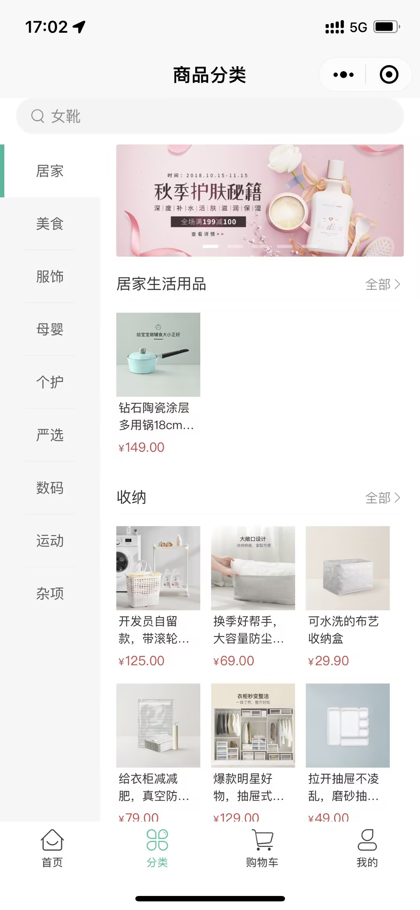
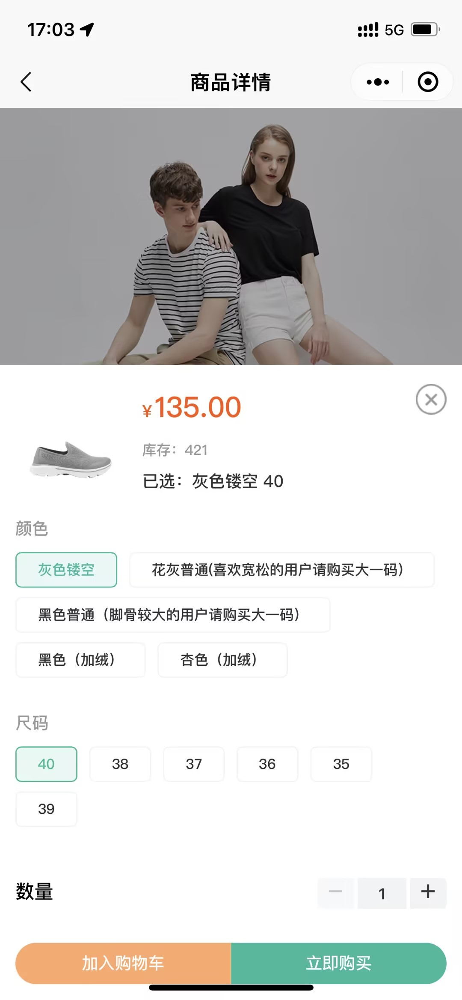

## 小兔鲜儿-微信小程序

### 项目简介

微信小程序端：该项目包含了从首页浏览商品，到商品详情，微信登录，加入购物车，提交订单，微信支付，订单管理等功能。

### 技术栈

- 前端框架：[uni-app](https://uniapp.dcloud.net.cn/) (Vue3 + TS)
- 状态管理：[pinia](https://pinia.vuejs.org/zh/)
- 组件库：[uni-ui](https://uniapp.dcloud.net.cn/component/uniui/uni-ui.html)

### 项目模块

- 项目起步
- 首页模块
- 推荐模块
- 分类模块
- 详情模块
- 登录模块
- 用户模块
- 地址模块
- SKU 模块
- 购物车模块
- 订单模块
- 项目打包

### 开发环境

- Windows 版本： Windows 10
- 开发工具： VS Code 、 HbuilderX 、 微信开发者工具
- Node 版本： v20.16.0
- pnpm 版本：v9.11.0

### 运行程序

1. 安装依赖

```shell
# npm
npm i --registry=https://registry.npmmirror.com

# pnpm
pnpm i --registry=https://registry.npmmirror.com
```

2. 运行程序

```shell
# 微信小程序端
npm run dev:mp-weixin
```

### 项目截图

<table>
  <tr>
    <td></td>
    <td></td>
    <td></td>
    <td></td>
    <td></td>
    <td></td>
  </tr>
  <tr>
    <td></td>
    <td></td>
    <td></td>
    <td></td>
    <td></td>
    <td></td>
  </tr>
</table>

# 备注:

此项目是跟 B 站黑马程序员的 uni-app 小兔鲜儿商城进行学习，感谢黑马程序员。
